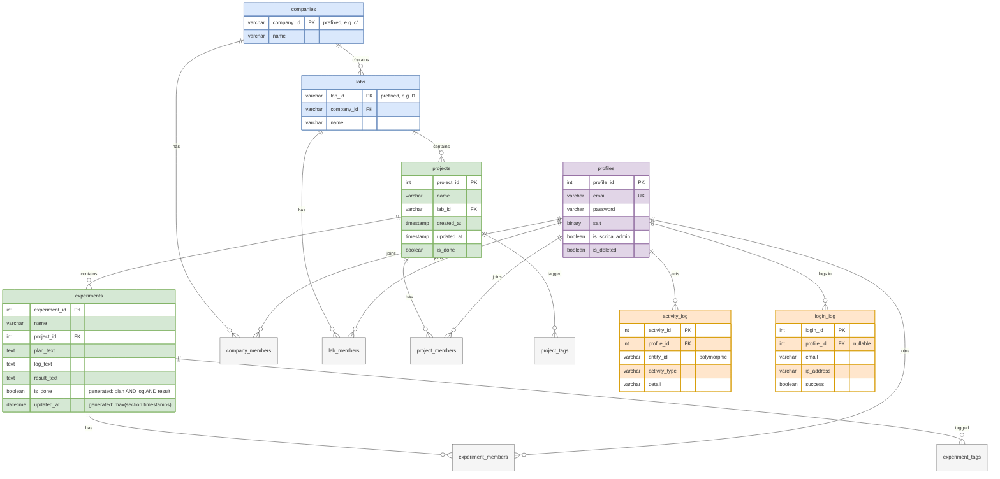

# Architecture

IMS (Inventory/Experiment Management System) is a plain PHP website with no
framework. Every page is a PHP script that runs top-to-bottom and renders its
own HTML. The structure below describes how files are organized and the
patterns the code follows.

## Folder layout

```
/                           Page scripts (one PHP file per page)
├── index.php               Login / start page
├── experiment.php          Experiment overview page
├── experiment_plan.php     Experiment plan section (log/result pages are stubs for now)
├── project_library.php     Listing pages, profile pages, etc.
│
├── Session/                Session handling
│   ├── init.php            Starts the session (guarded, safe to include anywhere)
│   └── check_user_logged_in.php
│
├── Database_related/       Database connection
│   ├── db.php              Opens $conn (mysqli)
│   └── closeDB.php         Closes $conn
│
└── Functional_php/         Shared functionality
    ├── user_permission.php     check_user_permission(): access level per entity
    ├── navbar.php, style.css   Layout and styling
    └── exp_helpers/         Experiment-related includes, split by purpose:
        ├── exp_fetch_*.php      Fetch data (tags, progress, text, timestamps)
        ├── exp_edit_*.php      Process form POSTs and redirect
        └── exp_progress_fun.php Helper function returning HTML for a progress badge
```

## Request flow

Every page script follows the same order:

1. **Session**: include `Session/init.php` (and the logged-in check where needed).
2. **Input**: read parameters from `$_GET` / `$_POST` with `??` defaults.
3. **Database**: include `Database_related/db.php` to get `$conn`.
4. **Permission check**: `check_user_permission($conn, $_SESSION['user_id'], <type>, <ID>)`
   returns an access level: 0 = none, 1 = read, 2 = edit, 3 = owner.
   Pages block on `< 1`; write endpoints block on `< 2`.
5. **Fetch and render**: include `exp_fetch_*.php` helpers to load data, then
   echo the HTML for the page.

## Patterns

### Includes as data-fetch steps
Fetcher files (`exp_fetch_*.php`) are not functions. They are included inline,
expect variables like `$exp_ID` to already exist, and leave their result in a
named variable (`$exp_tags_array`, `$exp_progress_flags`, `$exp_section_text`,
`$exp_last_update`). Each file documents the expected input and returned
variable in its header comment.

### POST-Redirect-Get (PRG) with session messages
Write endpoints (`exp_edit_section.php`, `exp_edit_tags.php`) never render a
page. They:
1. Validate the POST input: required fields (e.g. `exp_ID`) get a graceful
   "missing" message + redirect if absent, and input-driven column names are
   checked against a whitelist (`Plan` / `Log` / `Result`).
2. Re-check permission server-side (`>= 2` for writes) — the endpoint never
   trusts values posted by the form.
3. Collect feedback strings in a local `$messages` array.
4. Store it in the session under a page-specific key
   (`$_SESSION['messages_exp_edit_section']`).
5. `header("Location: ...")` + `exit()` back to the referring page.

The target page retrieves the message array from the session, unsets it, and
prints it. This keeps refresh/reload from resubmitting forms and gives the
user simple success/error feedback.

### Defensive null-guards in fetchers
Fetchers handle the two "no data" cases explicitly: a query that matches no
row (`fetch_assoc()` returns `null`) and a row whose column is `NULL`.
Text fetchers default to `''` (empty textarea for a new experiment); the
timestamp fetcher defaults to `[]` and formats values with `date()`, so a
missing row degrades to blank output rather than a fatal error. In practice
`check_user_permission()` throws first for invalid IDs, so these guards are
defensive.

### Access levels
Access levels come from one central query in `user_permission.php` that walks
the membership hierarchy (company → lab group → project → experiment) and
returns the highest applicable level. Invalid or unknown IDs make the
function throw `RuntimeException`; unimplemented entity types ('project',
'lab', ...) return 0 with a PHP warning. UI adapts to the level: view-only
users get static text, users with level >= 2 get the edit form.

### Database access
All queries use **mysqli prepared statements**. Values are always bound with
`bind_param()`. Column names that depend on input (e.g. the section name
`Plan`/`Log`/`Result`) are never taken raw from the request: they are checked
against a whitelist (`$valid_sections`) before being used in SQL.

### Output escaping
Anything echoed into HTML goes through `htmlspecialchars()` to prevent XSS
(this includes hidden input values, textarea content, and badge labels).
`urlencode()` is used when building query strings in links/redirects.

## Database schema

The canonical schema lives in
[Database_related/database_scriba_lucid_RH.sql](Database_related/database_scriba_lucid_RH.sql)
(MySQL). It defines the core entity tables (`companies`, `labs`, `projects`,
`experiments`, `profiles`), membership/tag junction tables, an audit layer
(`activity_log`, `login_log`), and two views (`project_updates`,
`profile_points`).

### Entity-relationship overview



Color key: **blue** = organization entities, **green** = research content,
**purple** = user accounts, **gray** = junction tables, **orange** = audit
tables. The views (`project_updates`, `profile_points`) are derived data and
not shown.

### Naming and conventions

The schema follows [Database naming standards](https://dev.to/ovid/database-naming-standards-2061):

- snake_case everywhere; plural table names, singular column names.
- Generic column names per table: `name`, `created_at`, `updated_at`, `is_done`.
- FKs are named after the PK they reference (`profile_id` in every table).
- PKs are auto-increment `INT`, except `company_id`/`lab_id` which are
  prefixed `VARCHAR(10)` (`c1`, `l1`, ...) to avoid collisions.
- `*_updated_at` columns are `DEFAULT CURRENT_TIMESTAMP ON UPDATE
  CURRENT_TIMESTAMP`; `is_done` flags default to `FALSE`.
- `experiments.updated_at` and `experiments.is_done` are **stored generated
  columns** derived from the plan/log/result sections, so an experiment's
  status can never disagree with its sections. `experiments.updated_at` is
  `DATETIME` (MySQL does not allow generated `TIMESTAMP` columns).

### Delete behavior

- Deleting a company with labs, or a lab with projects, is `RESTRICT`ed —
  handle in application code, in explicit order, in one transaction.
- Deleting a project cascades to its experiments, memberships, and tags.
  The UI must show a strong confirmation before deleting a project with
  experiments.
- Membership/tag junctions cascade on deletion of either side.

### GDPR compliance

Profile "deletion" is **anonymization, never a hard delete**:

1. Set `is_deleted = TRUE` (login checks this flag *before* password
   verification).
2. Overwrite: `email` → `deleted_<profile_id>@example.com`,
   names → `Deleted`, `salt` → fresh random bytes, `password` → a random,
   discarded hash.
3. Anonymize the user's email in `login_log` rows (including failed logins,
   matched by email).
4. Memberships are **intentionally kept** — they reference the anonymized
   profile, preserving authorship/audit history without personal data.
5. Ownership transfer for projects whose only owner is deleted is handled by
   the company/lab admin.

Retention: `activity_log` and `login_log` are purged daily after 90 days
(scheduled job). `profile_points` excludes deleted profiles
(`WHERE is_deleted = FALSE`).

Deleted-profile display rule: **hide** where they would be actionable (login,
member pickers/search); **render as "Deleted"** where they are historical
(member lists, activity timelines, admin ownership views).

## TODO: front-end / back-end implementation items

- [ ] `anonymize_profile($profile_id)` — implements the GDPR flow above.
- [ ] `log_activity(...)` helper — writes `activity_log` rows in the same
      transaction as the change they describe (the DB cannot know the actor).
- [ ] Daily cron job purging `activity_log` / `login_log` rows older than
      90 days.
- [ ] Login flow: check `is_deleted` before password verification; use
      `login_log` (email + 15-minute window) for rate limiting / lockout.
- [ ] Admin page: display project ownership, flagging projects owned by
      deleted profiles so admins can transfer them.
- [ ] Member management UI: exclude deleted profiles from pickers; show
      them as "Deleted" in existing member lists.
- [ ] Project deletion UI: strong confirmation when the project contains
      experiments.
- [ ] **Migration**: the current PHP code uses the old schema's names
      (`exp_ID`, `Plan`/`Log`/`Result` columns, etc.). All fetchers, edit
      endpoints, and `user_permission.php` must be updated to the new
      snake_case schema (`experiment_id`, `plan_text`, ...) and to key on
      `profile_id` (sessions currently store `user_id`).
